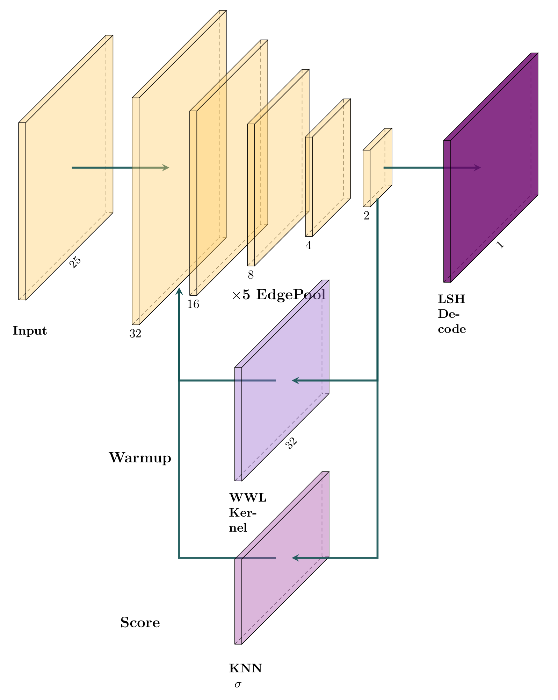
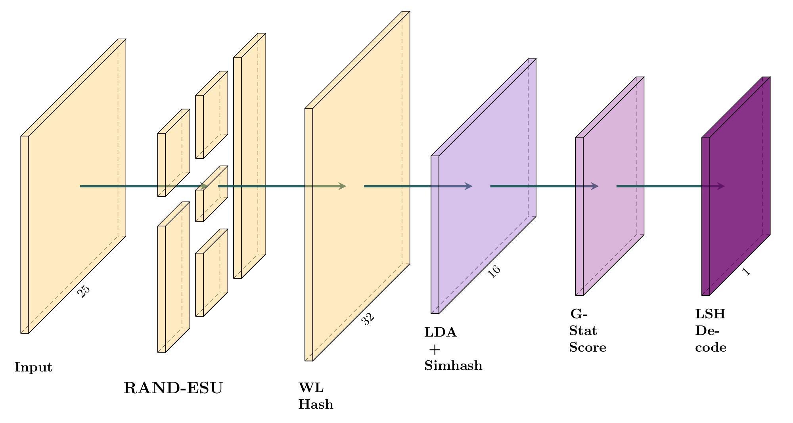
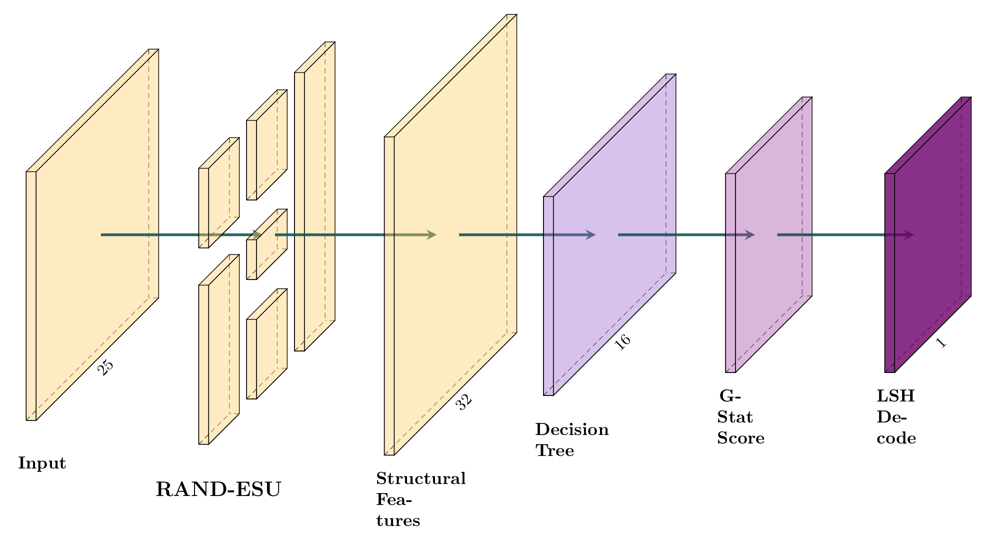
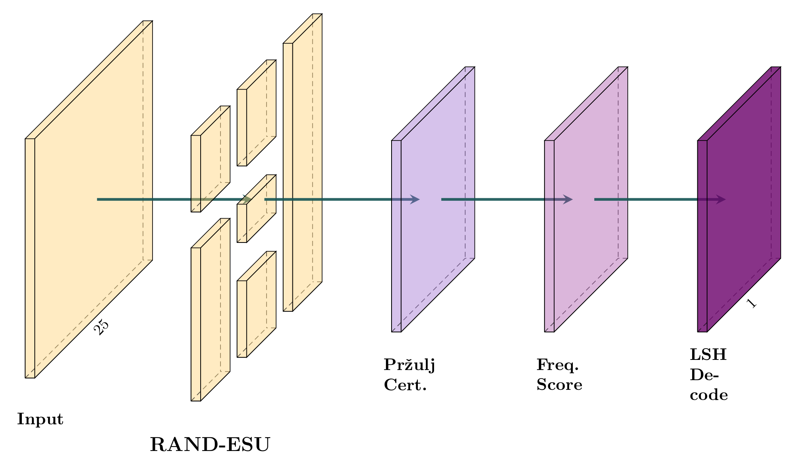

# MotiFiesta Discovery: Subgraph Representation Learning for Unsupervised Motif Discovery

This repository is forked from the MotiFiesta algorithm repository described in the following paper:

>Carlos Oliver, Dexiong Chen, Vincent Mallet, Pericles Philippopoulos, Karsten Borgwardt.
[Approximate Network Motif Mining Via Graph Learning][1]. Preprint 2022.

[][1]

## MotiFiesta



## Discovery Experiments

### WL



### Structural



### Canonical



## Setup

```
$ pip install . 
```

## Build dataset

```
$ python MotiFiesta/disc/gen_synth.py barbell
```

## Run discovery

```
$ python MotiFiesta/disc/run.py --name barbell-wl --embed-mode wl --data data/synth-barbell-k10 --dataset synth_pairs
$ python MotiFiesta/disc/run.py --name barbell-canonical --embed-mode canonical --data data/synth-barbell-k10 --dataset synth_pairs
```

[1]: https://arxiv.org/abs/2206.01008