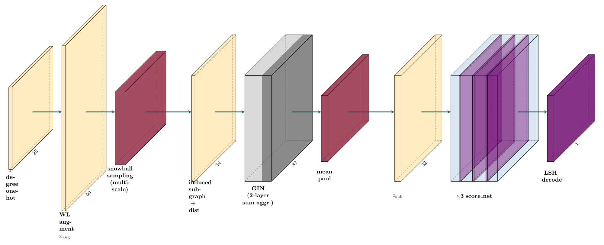

# MotiFiesta Discovery: Subgraph Representation Learning for Unsupervised Motif Discovery

This repository is forked from the MotiFiesta algorithm repository described in the following paper:

>Carlos Oliver, Dexiong Chen, Vincent Mallet, Pericles Philippopoulos, Karsten Borgwardt.
[Approximate Network Motif Mining Via Graph Learning][1]. Preprint 2022.

[][1]

## Architecture:



## Setup

```
$ pip install . 
```

## Build dataset

```
$ python MotiFiesta/utils/gen_synth.py barbell
```

## Train a model

```
$ scripts/motifiesta train --mode disc --name barbell-disc --dataset synth-barbell-k10 -e 10
```

## Decode

```
$ python MotiFiesta/training/disc_decode.py --name barbell-disc --data synth-barbell-k10
```

[1]: https://arxiv.org/abs/2206.01008